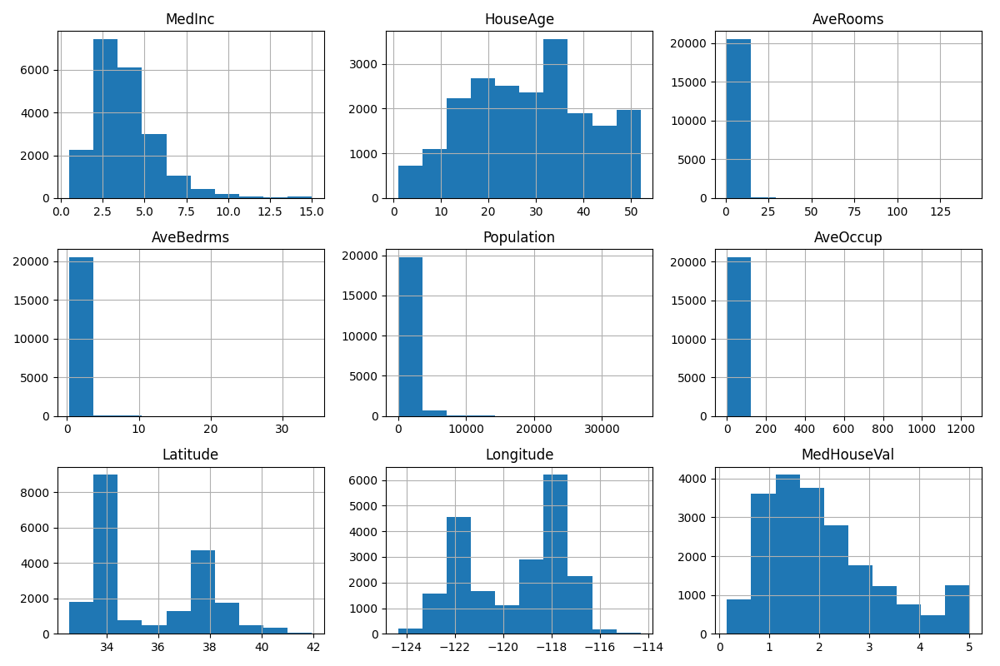
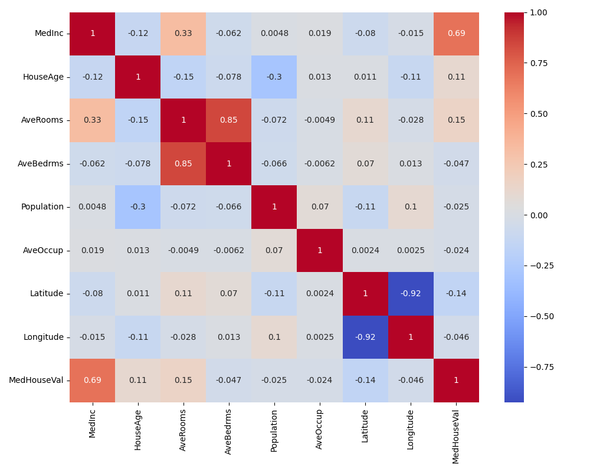
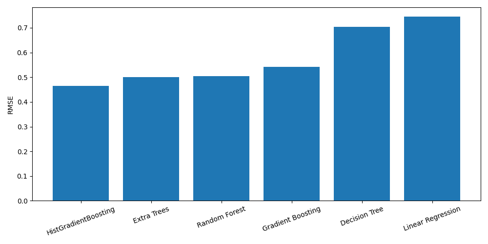

# 🏠 California Housing Price Prediction using Machine Learning


## 📌 Giới thiệu

Đây là dự án dự báo **giá nhà tại California** sử dụng bộ dữ liệu **California Housing Dataset** được cung cấp bởi Scikit-Learn.

Mục tiêu:

- Phân tích dữ liệu (EDA)
- Huấn luyện nhiều mô hình Machine Learning
- So sánh hiệu năng giữa các mô hình
- Chọn mô hình tốt nhất để dự báo giá nhà

---

## 📂 Dataset

California Housing Dataset

https://inria.github.io/scikit-learn-mooc/python_scripts/datasets_california_housing.html

Số lượng mẫu:

- 20,640 dòng

Số đặc trưng:

- 8 Feature
- 1 Target (MedHouseVal)

---

## 📁 Project Structure

```text
California-Housing-Prediction
│
├── src/
│   ├── load_data.py
│   ├── eda.py
│   ├── models.py
│   ├── evaluate.py
│   └── visualization.py
│
├── outputs/
│   ├── histogram.png
│   ├── correlation.png
│   └── model_comparison.png
│
├── models/
│   └── housing_model.pkl
│
├── main.py
├── requirements.txt
├── README.md
└── .gitignore
```

---

# 📊 Exploratory Data Analysis (EDA)

## Histogram



---

## Correlation Matrix



---

# 🤖 Machine Learning Models

Các mô hình đã sử dụng:

- Linear Regression
- Decision Tree
- Random Forest
- Extra Trees
- Gradient Boosting
- HistGradientBoosting

---

# 📈 Evaluation Metrics

Sử dụng:

- Mean Absolute Error (MAE)
- Root Mean Squared Error (RMSE)
- R² Score

---

# 🏆 Model Ranking

| Rank | Model |
|------|----------------------|
| 🥇 Top 1 | HistGradientBoosting |
| 🥈 Top 2 | Extra Trees |
| 🥉 Top 3 | Random Forest |
| 4 | Gradient Boosting |
| 5 | Decision Tree |
| 6 | Linear Regression |

---

## 📊 Model Comparison



---

# 🚀 Installation

Clone project

```bash
git clone https://github.com/TEN_GITHUB_CUA_BAN/California-Housing-Prediction.git
```

Move into project

```bash
cd California-Housing-Prediction
```

Install packages

```bash
pip install -r requirements.txt
```

Run

```bash
python main.py
```

---

# 📦 Python Packages

- pandas
- numpy
- matplotlib
- seaborn
- scikit-learn
- joblib

---

# 🎯 Future Improvements

- Feature Engineering
- Hyperparameter Tuning (GridSearchCV)
- Cross Validation
- XGBoost
- LightGBM
- CatBoost
- Model Stacking

---

# 👨‍💻 Author

Truong Thi Ngoc Han

GitHub:

https://github.com/lenhauyenuyen32

---

# ⭐ Nếu dự án hữu ích

Nếu bạn thấy dự án hữu ích hãy cho ⭐ repository.
